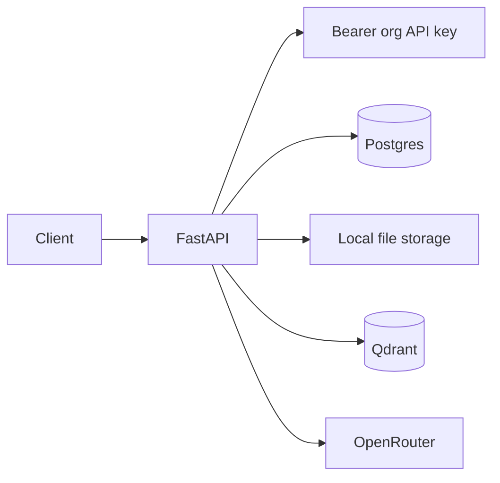
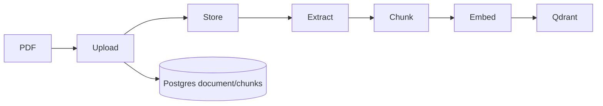
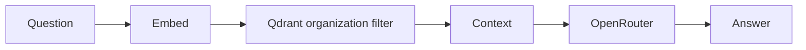
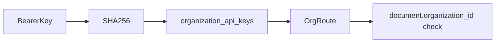

# Sentineth Project Status

## Vision

Sentineth is intended to be a company intelligence platform: it should connect Slack, Teams, GitHub, email, meetings, documents, and internal systems; continuously build organizational memory; become the company-wide source of truth; answer questions with grounded retrieval; and eventually power agent workflows.

## Current State Summary

Maturity is approximately **18%** of that vision. Today the repository provides a backend-first PDF RAG MVP: organizations, organization-filtered document storage and Qdrant search, local embeddings, OpenRouter answer generation, and basic document lifecycle APIs. It has no frontend, user accounts, RBAC, connectors, agents, background jobs, or production operations.

Architecture: FastAPI + SQLAlchemy/Postgres for state, local filesystem for source files, Qdrant for vectors, sentence-transformers MiniLM for embeddings, and OpenRouter for the answer model.

## Completed Work

### Multi-Tenant Foundation

`Organization`, `Document`, and Qdrant payloads carry organization identity. Retrieval filters Qdrant by `organization_id`; document deletion/reindex services compare the URL organization with `Document.organization_id`.

### Security Hardening

Commit `d8dec032e40c1b20f704f52fd82642b9aef90d45` — `feat: secure organization document lifecycle` — adds `OrganizationApiKey`, SHA-256 key storage, one-time key creation, rotation, route authorization, document ownership validation, and organization-scoped vector deletion. See `backend/app/security.py`, `backend/app/main.py`, and `backend/app/services/document_service.py`.

### RAG Infrastructure

PDF upload extracts text with pypdf, chunks it, embeds chunks, stores vectors in Qdrant, retrieves tenant-filtered chunks, and sends grounded context to OpenRouter. Sources return document/chunk metadata. Core paths are `backend/app/services/ingestion_service.py`, `retrieval_service.py`, and `query_service.py`.

### Document Lifecycle

Implemented routes: upload, list, delete, and single-document reindex in `backend/app/api/documents.py`. Delete removes organization-filtered vectors, the stored file, and the database record.

## Current Architecture

### Ingestion Flow

### Query Flow

### Authorization Flow

## Repository Map

- `backend/app/api`: FastAPI HTTP routes; `documents.py` owns lifecycle/search/query endpoints.
- `backend/app/services`: business flow; ingestion, chunking, extraction, retrieval, query, and document lifecycle.
- `backend/app/db`: SQLAlchemy engine and `Organization`, `Document`, `DocumentChunk`, `OrganizationApiKey` models.
- `backend/app/providers`: swappable embeddings, LLM, storage, and vector interfaces/adapters.
- `backend/tests`: in-memory provider tests for RAG and chunking.
- `backend/alembic`: schema migrations; API-key migration is `4bc9d8e2f3a1_add_organization_api_keys.py`.

## Current Technical Debt

- No user model, memberships, RBAC, audit logs, API-key expiry/list/revoke endpoint, rate limiting, secrets manager, observability, backups, DR, CI/CD, or production deployment pipeline.
- No dedicated authorization/lifecycle endpoint tests; the RAG fixture overrides authorization.
- Ingestion is synchronous and cross-system failure compensation is incomplete.
- PDF-only extraction; unsupported type currently maps to 500 rather than 415.
- Local storage and single-process embedding are scalability bottlenecks.
- No real Postgres/Qdrant/OpenRouter integration suite or retrieval benchmark.

## Vision Gap Analysis

### Already Built

PDF RAG, tenant-filtered vector retrieval, API-key foundation, and basic document lifecycle.

### Partially Built

Multi-tenancy and security: organization boundaries exist, but there are no users or roles. Organizational knowledge is document-only, not persistent cross-source memory.

### Completely Missing

Slack, GitHub, Teams, email, meeting ingestion, change detection, organizational memory, knowledge graph, agents/workflows, and frontend.

## Next Priorities

### Phase 1 — Production Foundation

| Priority | Why / dependencies / effort / approach |
|---|---|
| Users, memberships, roles/RBAC | Required for real tenant administration; depends on an identity-provider decision; 2–3 weeks; add User/Membership models and policy dependencies. |
| Authorization tests | Prevent tenant regressions; depends on auth fixtures; 3–5 days; test missing/wrong/revoked keys and cross-org lifecycle actions. |
| Audit logging | Required for enterprise trust; depends on actor model; 1 week; append immutable security/data events. |
| Background jobs | Avoid request-bound ingestion; depends on queue choice; 2 weeks; durable jobs, progress, retries, DLQ. |
| Object storage | Required for scale; depends on cloud choice; 1 week; provider adapter with signed access. |

### Phase 2 — Strategic Moat

| Priority | Why / dependencies / effort / approach |
|---|---|
| GitHub connector | Highest-value engineering context; OAuth/app model; 2–3 weeks; incremental sync of repos/issues/PRs. |
| Slack connector | Captures decisions and blockers; OAuth/events; 2–3 weeks; normalize channels/messages/threads. |
| Organizational memory and change sync | Turns RAG into intelligence; connector contracts; 4–8 weeks; shared people/project/decision/event schema. |
| Knowledge graph | Enables relationship reasoning; memory schema; 3–6 weeks; start with explicit normalized links. |

### Phase 3 — Product Experience

| Priority | Why / dependencies / effort / approach |
|---|---|
| Frontend | Required for customers; auth/workspace APIs; 3–5 weeks; workspace, library, chat, citations. |
| Search and citations | Trust and discovery; page metadata; 1–2 weeks; source viewer and filters. |
| Agents/workflows | Long-term action layer; reliable memory/RBAC/audit; 4–8 weeks; narrow, observable workflows first. |

## Enterprise Readiness Assessment

Security **30%**: hashed org keys and tenant filters, but no users/RBAC/audits/rate limits. Multi-tenancy **55%**: org filters and ownership checks exist, but membership administration is absent. Observability **5%**, compliance **5%**, reliability **20%**, scalability **15%**: none have production operating controls.

## Guidance For Future Contributors

Read this document and `AGENTS.md` first. Inspect architecture and call sites before edits. Preserve organization boundaries in every DB query, vector filter, storage path, and service action. Never bypass authorization. Keep commits narrowly scoped; do not mix generated artifacts with feature work; run tests before every commit.

## Recommended Next Task

Implement comprehensive authorization and lifecycle integration tests: missing/wrong/revoked keys, cross-organization list/delete/reindex attempts, reindex success/failure compensation, and API-key rotation. This is the highest-impact next task because the new security boundary is not yet independently tested.
